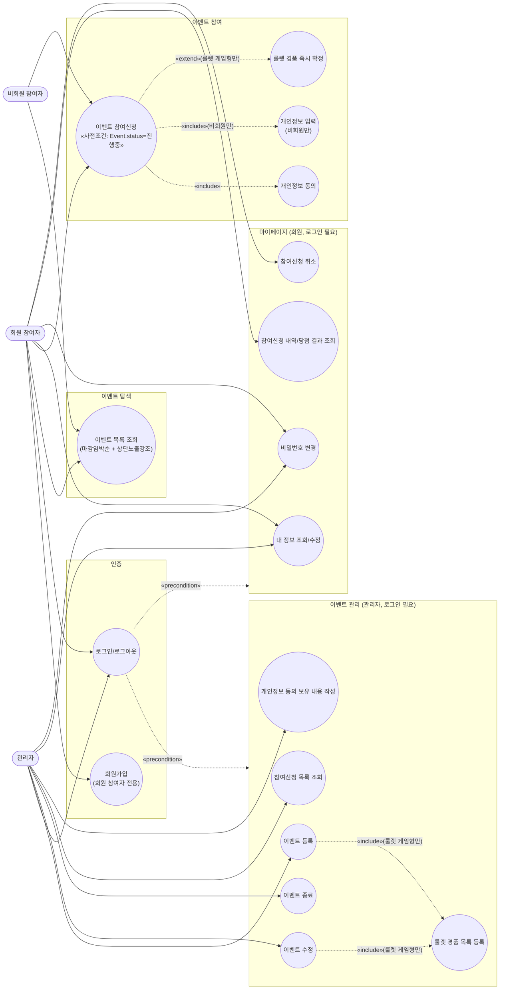

# 유스케이스 다이어그램: 온리원이벤트

## 변경이력
| 버전 | 일시 | 변경 내용 |
|---|---|---|
| v1.0 | 2026-08-13 | 최초 작성 |

`1-domain-definition.md`(v1.7)의 핵심 액터·핵심 유스케이스를 기반으로 작성했다. Mermaid는 UML 유스케이스 다이어그램을 네이티브로 지원하지 않아 `flowchart`로 표현했다(액터: 사각형, 유스케이스: 타원). 이벤트/참여신청의 상태 전이(등록→진행중→종료 등)는 이 문서의 범위가 아니며, 별도 상태 다이어그램에서 다룬다.

## 관계 설명
- **회원가입/로그인은 회원 참여자·관리자에게만 존재**: 비회원 참여자는 인증 없이 참여신청(UC32)과 이벤트 목록 조회(UC20)만 가능하다. 회원가입(UC01)은 회원 참여자 전용이며, 관리자 계정은 회원가입으로 생성하지 않는다(도메인 정의서 1절).
- **로그인은 이벤트 관리·마이페이지의 전제조건, `«precondition»`**: UC02(로그인)를 거쳐야 eventManage/mypage 그룹의 기능을 사용할 수 있다(도메인 정의서 7절 "회원 로그인이 필요한 기능은 인증을 요구").
- **UC10/UC11 → UC13(룰렛 경품 목록 등록), `«include»`, 룰렛 게임형만**: 경품 등록은 별도 기능이 아니라 이벤트 등록·수정 흐름에 포함된다(도메인 정의서 3절 "등록/수정...룰렛 경품 목록 지정 포함").
- **UC14(참여신청 목록 조회)와 UC15(개인정보 동의 보유 내용 작성)는 별개 유스케이스**: 전자는 신청자 목록을 보는 조회 기능, 후자는 신청 건별로 동의 보유 여부를 관리자가 직접 기록하는 작성 기능이다(도메인 정의서 3절, v1.4에서 표현 명확화).
- **UC32(이벤트 참여신청) → UC31(개인정보 동의), `«include»`**: 동의 없이는 참여신청 자체가 성립하지 않는다(회원/비회원 공통, 필수 사항).
- **UC32 → UC30(개인정보 입력), `«include»`, 비회원만**: 회원은 기존 회원 정보를 사용하므로 별도 입력이 없다.
- **UC32 → UC33(룰렛 경품 즉시 확정), `«extend»`, 룰렛 게임형만**: 단순 참여·폼 제출형에는 발생하지 않는 확장 흐름이다.
- **UC32는 이벤트 상태가 "진행중"일 때만 성립**(도메인 정의서 6절): 상태 전이 자체는 이 다이어그램 범위 밖이므로 노드 라벨에 사전조건만 각주로 남긴다.
- **UC43(참여신청 취소)은 회원 전용**: 비회원은 로그인 식별자가 없어 취소 기능 대상이 아니다(도메인 정의서 6절 참고).
