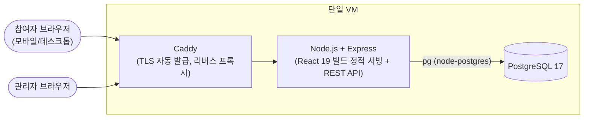
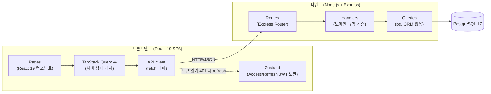

# 기술 아키텍처 다이어그램: 온리원이벤트

- 버전: v1.0 (2026-08-13)
- 관련 문서: [3-prd.md](./3-prd.md)(PRD v1.3 4절 기술 스택/아키텍처 개요, 6절 일정), [5-project-principle.md](./5-project-principle.md)(프로젝트 구조 설계 원칙)
- **이 문서의 역할**: 기술 스택을 새로 정하거나 재논의하지 않는다. PRD 4절·5절 문서에서 이미 확정된 스택(단일 VM + Caddy + Express + PostgreSQL, React 19 SPA, 레이어 3개 고정)을 그대로 전제하고, "이미 정해진 것들이 어떻게 배치·연결되는지"만 Mermaid로 시각화한다. 1인 개발/3일 일정, 오버엔지니어링 금지 원칙에 따라 실제로 쓰지 않는 컴포넌트(큐, 캐시, 마이크로서비스 등)는 그리지 않는다.

## 1. 전체 배포 구조도

참여자·관리자 모두 같은 경로로 들어온다. Caddy가 TLS를 처리해 Express로 넘기고, Express 하나가 React 빌드 정적 파일 서빙과 API 응답을 모두 담당하며 PostgreSQL 하나에만 접속한다. 큐·캐시·별도 알림 서비스는 없다.

## 2. 요청 처리 레이어 흐름도

프론트는 Pages → TanStack Query 훅 → API client 단방향 의존, Zustand는 인증 토큰만 보관하고 서버 데이터를 중복 저장하지 않는다. 백엔드는 Routes → Handlers → Queries 3계층 고정이며, 도메인 규칙(대상유형 검증, 동의, 중복 방지, 룰렛 추첨)은 전부 Handlers에 모여 있다.
