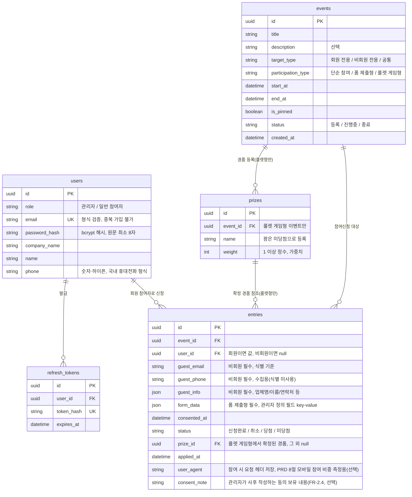

# ERD: 온리원이벤트

## 변경이력
| 버전 | 일시 | 변경 내용 |
|---|---|---|
| v1.0 | 2026-08-13 | 최초 작성 |
| v1.1 | 2026-08-20 | 사용자 요청으로 P0/P1 우선순위 구분 제거(PRD v1.7과 정합) — `consent_note` 설명의 "P1" 표기 삭제 |

- 관련 문서: [1-domain-definition.md](./1-domain-definition.md)(도메인 정의서 v1.7) 4~5절, [3-prd.md](./3-prd.md)(PRD v1.6) 4·8절, [5-project-principle.md](./5-project-principle.md) 7절
- **이 문서의 역할**: 새로운 스키마를 설계하지 않는다. 도메인 정의서 4절(엔티티) · 5절(관계)과 PRD 4절(테이블 5개, `schema.sql` 1파일, ORM 없음)에서 이미 확정된 구조를 Mermaid ERD로 시각화만 한다. 컬럼명은 프로젝트 원칙(5-project-principle.md 3절)에 따라 DB는 snake_case, 매핑은 애플리케이션 레이어(`rowMapper.js`)에서 처리한다.

## ERD

## 참고 사항 (다이어그램 문법으로 표현되지 않는 규칙)

- **UNIQUE 제약**: `entries`는 (event_id, user_id) 조합 유일(회원 기준), (event_id, guest_email) 조합 유일(비회원 기준). 중복 신청 방지는 앱 코드가 아닌 DB UNIQUE 제약으로 건다(PRD 4절).
- **nullable 조건**: `user_id`는 회원 참여인 경우만 값이 있고 비회원이면 null. `guest_email`/`guest_phone`/`guest_info`는 비회원 참여인 경우만 필수이고 회원이면 null. `form_data`는 폼 제출형 이벤트 참여인 경우만 값이 있다. `prize_id`는 룰렛 게임형에서 확정된 경우만 값이 있다.
- **조건부 FK 관계**: `prizes`와 `entries.prize_id`는 `events.participation_type = 룰렛 게임형`인 이벤트에만 해당하며, 그 외 참여 방식(단순 참여/폼 제출형)에서는 관련 없음(FK 자체는 컬럼상 항상 존재하되 값이 없다).
- **회원-이벤트 관계**: 도메인 정의서 5절상 회원과 이벤트는 참여신청(entries)을 매개로 한 다대다(N:M) 관계이나, ERD에는 매개 테이블인 entries를 통한 관계로만 표현한다.
- 마이그레이션 툴/버전 관리는 두지 않고 `schema.sql` 1개 파일로 관리한다(PRD 4절, 오버엔지니어링 금지).
