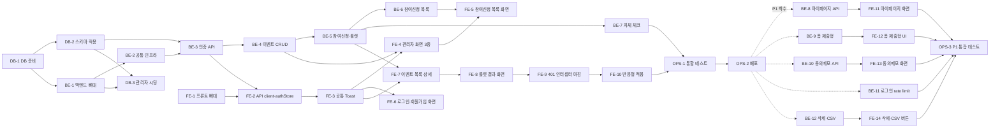

# 실행 계획: 온리원이벤트

## 변경이력
| 버전 | 일시 | 변경 내용 |
|---|---|---|
| v1.2 | 2026-08-13 | P1(FR-2.1~2.6) Task 반영: 5절에 마이페이지·폼 제출형·동의 보유 내용 작성·로그인 rate limit·이벤트 삭제/CSV 다운로드 Task(BE-8~12, FE-11~14, OPS-3) 추가. P0(1~4절)는 절대 변경하지 않음 |
| v1.3 | 2026-08-13 | 실제 개발 착수 시 확정된 환경변수명 반영: `DATABASE_URL` → `DB_CONN_STRING`, `.env` 위치를 `backend/.env`로 명시(DB-1, BE-1) |
| v1.4 | 2026-08-14 | docs 정합성 재검토: PRD 참조 버전을 실제 최신본(v1.6)으로 갱신 |

- 관련 문서: [1-domain-definition.md](./1-domain-definition.md)(도메인 정의서 v1.7), [3-prd.md](./3-prd.md)(PRD v1.6), [4-user-scenario.md](./4-user-scenario.md), [5-project-principle.md](./5-project-principle.md), [7-wireframe.md](./7-wireframe.md), [8-erd.md](./8-erd.md), [8-schema.sql](./8-schema.sql)
- **이 문서의 역할**: 앞선 문서에서 확정된 요구사항·구조·스키마를 **실행 가능한 Task 단위로 분해**한다. 새로운 요구사항이나 설계 결정을 만들지 않으며, 충돌 시 도메인 정의서 → PRD → 프로젝트 원칙 순으로 우선한다.
- **범위**: 1~4절은 PRD 3절의 **P0(FR-1.0~1.11)**, 5절은 **P1(FR-2.1~2.6)** 을 다룬다. P1은 P0가 전부 끝난 뒤(4일차 이후) 착수하는 것을 전제로 하며, 우선순위 자체를 재조정하지 않는다(PRD 3절 그대로).
- **Task ID 체계**: `DB-n`(데이터베이스) / `BE-n`(백엔드) / `FE-n`(프론트엔드) / `OPS-n`(통합·배포). P1 Task는 P0 번호에 이어서 채번한다(BE-8부터, FE-11부터 등)

---

## 0. 전체 의존성 개요

**일자별 배치**(PRD 6절 일정에 대응)

| 일차 | Task |
|---|---|
| 1일차 | DB-1, DB-2, BE-1, BE-2, BE-3, DB-3, BE-4, FE-1, FE-2, FE-3, FE-4 |
| 2일차 | BE-5, BE-6, BE-7, FE-5, FE-6, FE-7, FE-8 |
| 3일차 | FE-9, FE-10, OPS-1, OPS-2 |
| 4일차 이후(P1, 시간 남을 때만) | BE-8~12, FE-11~14, OPS-3 |

---

# 1. 데이터베이스 (DB)

## DB-1. PostgreSQL 17 준비 및 환경변수 구성

**선행 Task**: 없음 (프로젝트 시작점)

**작업 내용**
- PostgreSQL 17 인스턴스 준비, 프로젝트용 데이터베이스 1개 생성
- `backend/.env` 생성, 5개 변수 정의: `DB_CONN_STRING`, `JWT_ACCESS_SECRET`, `JWT_REFRESH_SECRET`, `ADMIN_SEED_EMAIL`, `ADMIN_SEED_PASSWORD`
- `.env.example`(키 이름·예시값만) 작성 후 커밋 대상에 포함
- `.gitignore`에 `.env`가 등록되어 있는지 확인

**완료 조건**
- [x] PostgreSQL 17에 접속 가능하고, 프로젝트 전용 데이터베이스가 생성되어 있다 (`postgres` 기본 DB를 로컬 개발용으로 그대로 사용하기로 결정, 접속 확인 완료)
- [x] `.env`에 5개 변수가 모두 값과 함께 존재한다
- [x] `.env.example`이 존재하고 실제 시크릿 값이 들어있지 않다
- [x] `git status`에 `.env`가 나타나지 않는다(무시되고 있다)

---

## DB-2. 스키마 적용 (테이블 5개 생성)

**선행 Task**: DB-1

**작업 내용**
- `docs/8-schema.sql`을 `backend/src/db/schema.sql`로 그대로 복사(내용 변경 금지 — 두 경로는 같은 내용, 다른 위치)
- 해당 SQL을 대상 DB에 실행하여 테이블 5개(`users`/`events`/`prizes`/`entries`/`refresh_tokens`)와 제약·인덱스를 생성

**완료 조건**
- [x] 5개 테이블이 모두 생성되어 있다(`\dt`로 확인)
- [x] `entries`에 부분 유니크 인덱스 2개(`uq_entries_event_user`, `uq_entries_event_guest_email`)가 존재하고, `INSERT ... ON CONFLICT (event_id, user_id) WHERE user_id IS NOT NULL DO NOTHING`이 예외 없이 동작한다(BE-5 전제조건) — 동일 (event_id, guest_email)로 2회 INSERT해 두 번째가 예외 없이 0행 반환됨을 확인
- [x] `entries.user_agent`, `entries.consent_note` 컬럼이 존재한다(둘 다 nullable, 이번 P0 범위에서는 값을 채우지 않아도 무방)
- [x] 잘못된 Enum 값 삽입 시 CHECK 제약으로 거부된다 (예: `events.status = 'FOO'` INSERT 실패) — `events_status_check` 위반으로 거부 확인
- [x] `prizes.weight = 0` INSERT가 CHECK 제약으로 거부된다 — `prizes_weight_check` 위반으로 거부 확인
- [x] `docs/8-schema.sql`과 `backend/src/db/schema.sql`의 내용이 동일하다 (`diff` 결과 동일)

---

## DB-3. 관리자 계정 시딩 (FR-1.0)

**선행 Task**: DB-2, BE-1

**작업 내용**
- `backend/src/db/seed.js` 작성: `.env`의 `ADMIN_SEED_EMAIL`/`ADMIN_SEED_PASSWORD`를 읽어 bcrypt(rounds 10) 해시 후 `users`에 `role='ADMIN'` 계정 1건 INSERT
- 이미 같은 이메일이 있으면 중복 생성하지 않도록 처리(재실행 안전)
- `package.json`에 실행 스크립트 추가(예: `npm run seed`)

**완료 조건**
- [x] `npm run seed` 실행 시 관리자 계정 1건이 생성된다
- [x] `users` 테이블에서 해당 계정의 `role`이 `ADMIN`이다
- [x] `password_hash` 컬럼에 평문이 아닌 bcrypt 해시가 저장되어 있다 (`$2b$10$...`, 60자)
- [x] 시드를 두 번 실행해도 계정이 중복 생성되지 않고 에러로 중단되지 않는다 (`ON CONFLICT (email) DO NOTHING`, 재실행 시 exit code 0으로 스킵 메시지만 출력)
- [x] 앱 내에 관리자 회원가입 경로를 만들지 않았다(도메인 1절 준수) — 이번 작업 범위에 회원가입 라우트/핸들러를 만들지 않음

---

# 2. 백엔드 (BE)

## BE-1. 백엔드 프로젝트 뼈대

**선행 Task**: DB-1

**작업 내용**
- `backend/` 초기화, 의존성 설치: `express`, `pg`, `bcrypt`, `jsonwebtoken`, `dotenv`, (개발 전용) `cors`
- `src/config/env.js`: `.env` 5개 변수 로드 및 누락 시 **부팅 즉시 실패**
- `src/db/pool.js`: `pg` Pool 생성
- `src/server.js`: Express 초기화, 포트 리슨, 헬스체크 라우트 1개

**완료 조건**
- [x] `npm start`로 서버가 기동되고 헬스체크 요청에 200을 응답한다 (`GET /health` → `{"status":"ok"}`)
- [x] `.env`에서 변수 하나를 지우면 서버가 부팅 단계에서 즉시 실패한다 (`JWT_ACCESS_SECRET` 제거 후 실행 → 누락 메시지 출력 + exit code 1 확인, `.env` 원상 복구 완료)
- [x] `pool.js`를 통해 DB에 실제 쿼리(`SELECT 1`)가 성공한다 (`[{"?column?":1}]` 반환 확인)
- [x] 마이그레이션 툴·ORM을 설치하지 않았다(원칙 1절) — 의존성 6개(`bcrypt`/`dotenv`/`express`/`jsonwebtoken`/`pg`/`cors`)뿐, ORM/마이그레이션 툴 없음
- [x] (추가 검증) `src/config/env.js`/`src/db/pool.js`/`src/server.js` 자체 테스트 10건 전부 통과, 라인/브랜치/함수 커버리지 100%(`node --test --experimental-test-coverage`)

---

## BE-2. 공통 인프라 (Enum·에러·미들웨어·rowMapper)

**선행 Task**: BE-1

**작업 내용**
- `src/shared/enums.js`: 프로젝트 원칙 3절 매핑표의 코드 상수 5종(`targetType`/`participationType`/`Event.status`/`Entry.status`/`User.role`)
- `src/shared/errors.js`: `AppError` 클래스 + 에러 코드 6개(`DUPLICATE_ENTRY`, `TARGET_TYPE_MISMATCH`, `EVENT_CLOSED`, `CONSENT_REQUIRED`, `VALIDATION_ERROR`, `INTERNAL_ERROR`)
- `src/middleware/errorHandler.js`: `{ "error": { "code", "message" } }` 포맷 단일 생성 지점. 예상 못한 예외는 500+`INTERNAL_ERROR`로 통일하고 스택은 서버 로그에만
- `src/middleware/requestLogger.js`: `메서드 경로 상태코드 응답시간` 한 줄 로그
- `src/db/rowMapper.js`: snake_case row → camelCase 객체 범용 변환

**완료 조건**
- [x] 임의 라우트에서 `throw new AppError('EVENT_CLOSED', ...)` 시 지정 포맷 JSON이 응답된다 (`test/errorHandler.test.js` — 409 + `{"error":{"code":"EVENT_CLOSED","message":"..."}}` 확인)
- [x] 처리되지 않은 예외 발생 시 응답 바디에 스택이 노출되지 않고 `INTERNAL_ERROR`로 통일된다 (`test/errorHandler.test.js` — 500 + `INTERNAL_ERROR`, 바디에 원본 에러 메시지·스택 없음 확인, 스택은 `console.error`로 서버 로그에만 출력)
- [x] 요청 1건당 로그가 1줄 출력되고, 그 로그에 비밀번호·토큰·개인정보가 없다 (`test/requestLogger.test.js` — `POST /login 200 Nms` 형식 1줄, 요청 바디의 비밀번호 값 미포함 확인)
- [x] `rowMapper`가 `{ user_id, created_at }` → `{ userId, createdAt }`으로 변환한다 (`test/rowMapper.test.js` 통과)
- [x] Enum 상수 값이 프로젝트 원칙 3절 매핑표와 스펠링까지 일치한다 (`test/enums.test.js` — `MEMBER_ONLY`/`GUEST_ONLY`/`COMMON`, `SIMPLE`/`FORM`/`ROULETTE`, `SCHEDULED`/`ONGOING`/`CLOSED`, `APPLIED`/`CANCELED`/`WON`/`LOST`, `ADMIN`/`MEMBER` 전부 일치)

---

## BE-3. 인증 API (FR-1.1, FR-1.2)

**선행 Task**: BE-2, DB-2

**작업 내용**
- `db/queries/usersQueries.js`, `db/queries/refreshTokensQueries.js`
- `handlers/authHandlers.js`: 회원가입(FR-1.1), 로그인/로그아웃(FR-1.2), Access/Refresh 재발급
  - 회원가입: 이메일 형식·중복 검사, 비밀번호 원문 8자 이상 검증 후 bcrypt(rounds 10) 해시 저장, `role='MEMBER'` 고정
  - 회원가입/로그인의 이메일 비교는 항상 trim 후 소문자로 정규화한 값으로 수행(도메인 정의서 7절 — 대소문자·공백 차이로 중복 검사가 깨지지 않도록)
  - 로그인: Access(1시간)+Refresh(14일) 발급, Refresh는 해시로 `refresh_tokens`에 저장, **두 토큰 모두 응답 바디로 반환**(쿠키 미사용)
  - 재발급: Refresh 검증 후 회전(기존 토큰 삭제 + 신규 발급)
  - 로그아웃: 해당 Refresh 토큰 폐기
- `middleware/auth.js`: JWT 검증 + `role` 체크. payload는 `userId`/`role`만
- `routes/authRoutes.js` 및 `server.js` 마운트

**완료 조건**
- [ ] curl로 회원가입 → 로그인 → Access/Refresh 토큰 2개를 응답 바디로 받는다
- [ ] 비밀번호 7자로 가입 시 `VALIDATION_ERROR`(400)로 거부된다
- [ ] 이미 가입된 이메일로 재가입 시 거부되고 메시지가 "이미 가입된 이메일" 취지다(S-6)
- [ ] 대소문자·앞뒤 공백만 다른 이메일(`A@corp.com` vs ` a@corp.com `)로 재가입 시에도 중복으로 거부된다(도메인 7절 정규화 규칙)
- [ ] 잘못된 비밀번호 로그인 시 이메일/비밀번호 중 무엇이 틀렸는지 구분해 알려주지 않는다(S-6)
- [ ] Refresh로 재발급 시 새 Access가 발급되고, **같은 Refresh를 다시 쓰면 실패**한다(회전 확인)
- [ ] 로그아웃 후 해당 Refresh로 재발급이 실패한다
- [ ] 인증 필요 라우트에 토큰 없이 접근하면 401이다
- [ ] `role='MEMBER'` 토큰으로 관리자 전용 라우트 접근 시 거부된다
- [ ] `Set-Cookie` 헤더를 사용하지 않는다(PRD 4절, 쿠키 미사용)

---

## BE-4. 이벤트 CRUD·경품·목록 정렬 API (FR-1.3, FR-1.7, FR-1.8)

**선행 Task**: BE-3

**작업 내용**
- `db/queries/eventsQueries.js`, `db/queries/prizesQueries.js`
- `handlers/eventsHandlers.js`
  - 등록/수정(FR-1.7): 룰렛 게임형이면 경품 목록(name/weight) 함께 저장. `weight`는 1 이상 정수 검증
  - 진행중 상태 수정 제한(도메인 6절): `targetType`/`participationType`/`startAt` 변경 불가, `endAt`은 **연장만** 허용
  - 종료(FR-1.8): 진행중 → 종료 단방향 전환
  - 목록(FR-1.3): `is_pinned DESC, end_at ASC, created_at ASC` 정렬
  - 상태 **lazy 계산**: 조회/참여 시점에 현재 시각과 `startAt`/`endAt`을 비교해 계산(배치·크론 없음)
  - 룰렛 게임형은 경품 1건 이상이어야 진행중 전환 가능
- `routes/eventsRoutes.js`(관리자 전용 경로는 role 미들웨어 적용)

**완료 조건**
- [ ] 관리자 토큰으로 룰렛 이벤트를 경품 3건과 함께 등록할 수 있다
- [ ] 경품 0건인 룰렛 이벤트는 진행중으로 전환되지 않는다(도메인 6절)
- [ ] `weight`에 0 또는 음수를 넣으면 `VALIDATION_ERROR`로 거부된다
- [ ] 목록 조회 결과가 상단노출 → 마감임박순 → 동률 시 등록순으로 정렬된다
- [ ] `endAt`이 지난 이벤트가 DB 컬럼값과 무관하게 `CLOSED`로 조회된다(lazy 계산, S-10)
- [ ] 진행중 이벤트의 `targetType`/`participationType`/`startAt` 수정 요청이 거부된다
- [ ] 진행중 이벤트의 `endAt`을 앞당기는 요청은 거부되고, 연장은 허용된다
- [ ] 종료 처리 후 상태가 `CLOSED`가 되고 되돌리는 API가 존재하지 않는다
- [ ] 일반 회원 토큰으로 이벤트 등록/종료를 시도하면 거부된다
- [ ] 스케줄러·크론을 도입하지 않았다

---

## BE-5. 참여신청 API + 룰렛 추첨 (FR-1.4, FR-1.5, FR-1.6)

**선행 Task**: BE-4

**작업 내용**
- `db/queries/entriesQueries.js`
- `handlers/entriesHandlers.js` — 이 프로젝트의 핵심 파일. 단일 트랜잭션 안에서 아래를 순서대로 처리
  1. 이벤트 상태 검증(진행중 아니면 `EVENT_CLOSED`)
  2. 참여 대상 유형 검증 3종 전부(불일치 시 `TARGET_TYPE_MISMATCH`)
  3. 개인정보 동의 검증(미동의 시 `CONSENT_REQUIRED`), `consentedAt` 기록
  4. 회원/비회원 분기: 회원은 `userId`, 비회원은 `guestEmail`(trim+소문자 정규화 후 식별 기준으로 사용, 도메인 7절)·`guestPhone`·`guestInfo` 저장. 요청 헤더의 User-Agent를 `user_agent`에 함께 저장(PRD 8절 모바일 비중 측정용)
  5. 중복 처리: `INSERT ... ON CONFLICT (event_id, user_id 또는 guest_email) DO NOTHING RETURNING id`로 충돌을 예외 없이 감지(5-project-principle.md 2절 — 예외 catch 방식은 트랜잭션을 abort시켜 이후 쿼리가 전부 실패하므로 쓰지 않는다) → 반환 행이 없으면 기존 레코드 상태 조회 → `APPLIED/WON/LOST`면 `DUPLICATE_ENTRY` 거부 / `CANCELED`면 같은 트랜잭션에서 `UPDATE ... SET status='APPLIED'`로 전환(재신청)
  6. 룰렛 게임형이면 경품 목록을 `weight` 비율로 추첨해 1건 확정, 같은 트랜잭션에서 `prizeId`와 `status`(`WON`/`LOST`) 저장. 재추첨 불가
- 단순 참여형은 `status='APPLIED'`로만 저장(당첨/미당첨 상태 미사용)
- 성공 시 응답에 확정 경품 정보 포함(룰렛형)
- `routes/entriesRoutes.js` — 참여신청은 **인증 없이도 호출 가능**해야 함(비회원 참여)

**완료 조건**
- [ ] 비회원이 진행중 공통 이벤트에 참여 시 신청이 생성되고 룰렛 결과가 응답에 포함된다(S-1)
- [ ] 회원 토큰으로 참여 시 개인정보 입력 없이 동의만으로 신청이 성립한다(도메인 7절)
- [ ] 미동의 요청이 `CONSENT_REQUIRED`로 거부되고 레코드가 생성되지 않는다(S-2)
- [ ] 회원 전용 이벤트에 비로그인 참여 시 `TARGET_TYPE_MISMATCH`로 거부된다(S-3)
- [ ] 비회원 전용 이벤트에 회원 토큰으로 참여 시도 시 `TARGET_TYPE_MISMATCH`로 거부된다(S-3)
- [ ] 같은 이메일로 같은 이벤트에 재참여 시 `DUPLICATE_ENTRY`로 거부되고 **룰렛이 다시 돌지 않는다**(S-4, S-5)
- [ ] `CANCELED` 상태 레코드가 있는 참여자의 재신청은 새 레코드 없이 `APPLIED`로 되돌아간다
- [ ] 종료된 이벤트 참여 요청이 `EVENT_CLOSED`로 거부된다(S-9)
- [ ] 참여 버튼 연타(동시 2회 요청)에도 레코드가 1건만 생기고 추첨이 2회 일어나지 않는다(S-5)
- [ ] 룰렛 추첨과 참여신청 저장이 **같은 트랜잭션**이며, 큐/워커/락 서비스를 도입하지 않았다
- [ ] 재추첨 API가 존재하지 않는다

---

## BE-6. 참여신청 목록 조회 API (FR-1.9)

**선행 Task**: BE-5

**작업 내용**
- 이벤트별 참여신청 목록 조회 엔드포인트(관리자 전용, role 미들웨어 적용)
- 응답 항목: 회원/비회원 구분, 업체명·담당자·이메일·연락처, 동의 시각(`consentedAt`), 확정 경품, 상태, 신청 시각
- 신청 시각 순 정렬, 0건이면 빈 배열

**완료 조건**
- [ ] 관리자 토큰으로 이벤트별 참여신청 목록을 조회할 수 있다
- [ ] 회원 참여 건과 비회원 참여 건이 모두 조회되고 구분 가능하다
- [ ] 각 행에 동의 시각과 확정 경품(룰렛형)이 포함된다
- [ ] 참여신청이 0건인 이벤트 조회 시 에러가 아니라 빈 결과가 반환된다
- [ ] 일반 회원 토큰으로 조회 시 거부된다
- [ ] 이벤트 종료 후 조회 시 건수가 더 이상 증가하지 않는다(S-9)

---

## BE-7. 핵심 로직 자체 체크 (2건)

**선행 Task**: BE-5

**작업 내용**
- 테스트 프레임워크를 설치하지 않고 Node 내장 `assert` + `node --test`만 사용
- `test/drawPrize.test.js`: 가중치 추첨 함수 — 충분한 시행 횟수에서 각 경품이 `weight` 비율에 근사하게 뽑히는지, `weight` 0/음수를 거부하는지
- `test/duplicateEntry.test.js`: 중복 신청 판정 분기 — 기존 상태가 `APPLIED/WON/LOST`면 거부, `CANCELED`면 재신청 전환

**완료 조건**
- [ ] `node --test`로 두 테스트 파일이 모두 통과한다
- [ ] 가중치를 (1, 5, 94)로 두고 다수 시행 시 분포가 대략 비례한다는 것이 단언으로 검증된다
- [ ] 취소 상태 재신청이 새 레코드 생성이 아니라 상태 전환으로 처리됨이 단언으로 검증된다
- [ ] Jest 등 테스트 프레임워크를 추가 설치하지 않았다
- [ ] 화면 렌더링·라우팅·CRUD에 대한 테스트는 작성하지 않았다(원칙 4절)

---

# 3. 프론트엔드 (FE)

## FE-1. 프론트 프로젝트 뼈대

**선행 Task**: 없음 (백엔드와 병렬 착수 가능)

**작업 내용**
- `frontend/` 초기화(Vite + React 19), 의존성: `zustand`, `@tanstack/react-query`, `react-router-dom`
- **TypeScript 도입 금지** — 컴포넌트는 `.jsx`, 그 외 모듈은 `.js`
- `src/constants/domain.js`: 백엔드 `shared/enums.js`와 **같은 값**을 복사(모노레포·공유 패키지 금지)
- `src/App.jsx`: 라우팅 골격(참여자 경로 / 관리자 경로 분리)
- 로컬 개발용 Vite proxy 또는 dev 오리진 CORS 허용 설정

**완료 조건**
- [ ] `npm run dev`로 개발 서버가 뜨고 빈 라우트가 렌더링된다
- [ ] `.ts`/`.tsx` 파일이 하나도 없다
- [ ] `constants/domain.js`의 Enum 값이 백엔드 `shared/enums.js`와 스펠링까지 동일하다
- [ ] 로컬에서 프론트 → 백엔드 API 호출이 CORS 오류 없이 성공한다

---

## FE-2. API client · 인증 스토어

**선행 Task**: FE-1, BE-3

**작업 내용**
- `src/api/client.js`: fetch 래퍼. **여기서만** 토큰을 읽어 `Authorization` 헤더에 부착
- `src/store/authStore.js`: zustand + persist(localStorage). Access/Refresh 토큰과 로그인 사용자 정보 보관
- `src/api/authApi.js`, `eventsApi.js`, `entriesApi.js`: 엔드포인트별 함수(로직 없음)
- TanStack Query Provider 설정
- 401 인터셉터·부팅 silent refresh는 **FE-9에서 마감**(여기서는 기본 토큰 부착까지)

**완료 조건**
- [ ] 로그인 성공 시 두 토큰이 스토어에 보관되고 새로고침해도 유지된다
- [ ] 인증 필요 API 호출 시 `Authorization` 헤더가 자동으로 붙는다
- [ ] Pages/컴포넌트 코드에서 `fetch`를 직접 호출하는 곳이 없다(원칙 2절)
- [ ] Zustand에 서버 데이터(이벤트·참여신청 목록 등)를 중복 보관하지 않는다

---

## FE-3. 공통 Toast (에러 코드 6종)

**선행 Task**: FE-2

**작업 내용**
- `src/components/Toast.jsx`: 공통 에러 표시 1개. 서버 에러 응답의 `error.code`/`error.message`를 그대로 사용자에게 표시
- 6개 코드(`DUPLICATE_ENTRY`/`TARGET_TYPE_MISMATCH`/`EVENT_CLOSED`/`CONSENT_REQUIRED`/`VALIDATION_ERROR`/`INTERNAL_ERROR`) 모두 이 컴포넌트로 처리

**완료 조건**
- [ ] 6종 에러 코드가 모두 동일한 Toast로 표시된다
- [ ] 화면마다 별도 에러 UI를 만들지 않았다
- [ ] `INTERNAL_ERROR` 발생 시 사용자에게 스택·내부 정보가 노출되지 않는다

---

## FE-4. 관리자 화면 3종 (FR-1.7, FR-1.8)

**선행 Task**: FE-3, BE-4

**작업 내용** — 와이어프레임 5·6·7절 기준, **반응형 대상 아님**(데스크톱 고정폭)
- `pages/admin/AdminLoginPage.jsx`: 시드 계정 로그인
- `pages/admin/AdminEventListPage.jsx`: 전체 이벤트 테이블(상태/참여자수/상단노출), 등록 버튼, **종료 버튼**(FR-1.8)
- `pages/admin/AdminEventFormPage.jsx`: 등록/수정 공용. 참여 방식이 룰렛일 때만 경품(name/weight) 입력 영역 노출. 진행중 상태에서는 수정 불가 필드 비활성화

**완료 조건**
- [ ] 시드 관리자 계정으로 로그인해 이벤트 목록에 진입한다
- [ ] 룰렛 게임형 선택 시에만 경품 입력 영역이 나타난다
- [ ] 경품 행 추가/삭제가 동작하고 `weight`에 0/음수 입력 시 안내가 뜬다
- [ ] 진행중 이벤트 수정 화면에서 참여대상유형·참여방식·시작일시 입력칸이 비활성화된다
- [ ] 종료 버튼 클릭 → 확인 후 상태가 `종료`로 바뀌고 목록에 반영된다
- [ ] 종료된 이벤트에는 종료 버튼이 노출되지 않는다
- [ ] **브라우저에서 관리자 로그인 → 룰렛 이벤트 등록 → 목록 확인 → 종료까지 관리자 화면만으로 완결된다**(PRD 1일차 완료 기준)

---

## FE-5. 관리자 참여신청 목록 화면 (FR-1.9)

**선행 Task**: FE-4, BE-6

**작업 내용**
- `pages/admin/AdminEntryListPage.jsx`: 이벤트별 신청자 테이블(구분/업체명/담당자/이메일/동의시각/경품/상태)
- 이벤트 목록에서 행 클릭 시 진입
- 0건일 때 "참여신청이 없습니다" 빈 상태 표시

**완료 조건**
- [ ] 이벤트 목록에서 특정 이벤트의 참여신청 목록으로 이동한다
- [ ] 회원/비회원 참여 건이 구분되어 표시된다
- [ ] 동의 시각과 확정 경품이 각 행에 표시된다
- [ ] 참여신청 0건일 때 에러가 아니라 빈 상태 문구가 보인다
- [ ] 엑셀 다운로드 버튼을 만들지 않았다(FR-2.6은 P1)

---

## FE-6. 로그인 / 회원가입 화면 (FR-1.1, FR-1.2)

**선행 Task**: FE-3

**작업 내용** — 와이어프레임 4절 기준
- `pages/auth/LoginPage.jsx`: 이메일·비밀번호
- `pages/auth/SignupPage.jsx`: 이메일·비밀번호(8자 이상)·업체명·담당자명·연락처
- 로그인 실패/이메일 중복 메시지 처리(S-6)

**완료 조건**
- [ ] 회원가입 후 해당 계정으로 로그인이 성공한다
- [ ] 비밀번호 8자 미만 입력 시 제출 전 안내가 표시된다
- [ ] 중복 이메일 가입 시 "이미 가입된 이메일입니다" 취지의 메시지가 뜬다
- [ ] 로그인 실패 시 이메일/비밀번호 중 무엇이 틀렸는지 구분해 알려주지 않는다
- [ ] 로그아웃 시 토큰이 지워지고 인증 필요 화면 접근이 차단된다

---

## FE-7. 참여자 이벤트 목록 · 상세 (FR-1.3, FR-1.4, FR-1.5)

**선행 Task**: FE-3, BE-5

**작업 내용** — 와이어프레임 1·2절 기준
- `pages/events/EventListPage.jsx`: 마감임박순 + 상단노출 강조 + 상태 뱃지
- `pages/events/EventDetailPage.jsx`: 상태 분기 3종
  - ① 회원 로그인 참여 폼(개인정보 입력 없음, 동의 체크만)
  - ② 비회원 입력 폼(업체명/담당자명/이메일/연락처 + 동의)
  - ③ 대상유형 불일치 안내 + 로그인/회원가입 버튼
  - 추가: 종료/미시작 이벤트는 참여 버튼 비활성 + 안내
- `components/ConsentCheckbox.jsx`: 동의 문구 + **보유기간(이벤트 종료일로부터 1년) 고지**, 회원/비회원 공용

**완료 조건**
- [ ] 목록이 상단노출 → 마감임박순 → 동률 시 등록순으로 노출된다
- [ ] 마감이 지난 이벤트에 `종료` 뱃지가 표시된다(S-10)
- [ ] 로그인 상태·이벤트 대상유형 조합에 따라 3가지 분기가 각각 올바르게 렌더링된다
- [ ] 동의 체크 전에는 참여 버튼이 비활성이다(S-2)
- [ ] 동의 문구에 보유기간 1년이 고지된다
- [ ] 회원 참여 화면에 개인정보 입력 폼이 나타나지 않는다
- [ ] 종료된 이벤트 상세에서 참여가 시작되지 않는다
- [ ] 중복 참여 시 Toast로 "이미 참여하셨습니다" 취지 메시지가 표시된다(S-4)

---

## FE-8. 룰렛 결과 화면 (FR-1.10)

**선행 Task**: FE-7

**작업 내용** — 와이어프레임 3절 기준
- `pages/events/RouletteResultPage.jsx`: 회전 애니메이션 1회 후 **서버가 이미 확정한 결과** 표시
- 미당첨도 오류가 아닌 정상 결과로 표시
- **"이 화면을 캡처해 두세요" 안내 문구**(비회원은 재조회 경로 없음)
- "다시 돌리기" 버튼을 만들지 않음(재추첨 불가)

**완료 조건**
- [ ] 참여 직후 결과 화면으로 이동하고 경품명이 표시된다
- [ ] 미당첨 결과가 에러 토스트가 아니라 정상 결과 문구로 표시된다
- [ ] 캡처 안내 문구가 노출된다
- [ ] 재시도/다시 돌리기 버튼이 화면에 존재하지 않는다(S-5)
- [ ] 애니메이션이 결과를 결정하지 않는다(서버 확정값만 표시)
- [ ] `prefers-reduced-motion` 설정 시 애니메이션이 과하게 동작하지 않는다

---

## FE-9. 401 인터셉터 · 부팅 silent refresh 마감

**선행 Task**: FE-8

**작업 내용**
- `api/client.js`: 401 응답 시 Refresh로 재발급 후 원 요청 1회 재시도. 동시 다발 401에서 refresh가 중복 호출되지 않도록 처리
- `main.jsx`: 앱 부팅 시 저장된 Refresh가 있으면 먼저 재발급 시도(silent refresh), 완료 전까지 라우팅 대기. 실패 시 비로그인 상태로 시작

**완료 조건**
- [ ] Access 만료 상태에서 API 호출 시 사용자가 실패를 보지 않고 자동 재발급 후 성공한다
- [ ] 새로고침 후에도 로그인 상태가 유지되고 로그인 화면으로 튕기지 않는다
- [ ] 여러 요청이 동시에 401을 받아도 refresh 요청이 중복 발생하지 않는다
- [ ] Refresh 재발급까지 실패하면 비로그인 상태로 전환되고 로그인 화면으로 안내된다
- [ ] 쿠키를 사용하지 않는다

---

## FE-10. 반응형 적용 (FR-1.11)

**선행 Task**: FE-9

**작업 내용** — 와이어프레임 기준, **단일 브레이크포인트 768px만** 사용
- EventListPage: 모바일 1열 → 데스크톱 2~3열 그리드
- EventDetailPage: 모바일 세로 스택 → 데스크톱 좌우 2단
- RouletteResultPage: 데스크톱에서도 카드 폭 유지, 좌우 여백만 확대
- LoginPage/SignupPage: 모바일 풀폭 → 데스크톱 400px 고정폭 중앙 카드
- **관리자 백오피스는 반응형 대상에서 제외**

**완료 조건**
- [ ] 참여자용 화면 전부가 모바일 폭에서 가로 스크롤 없이 표시된다
- [ ] 768px을 경계로 레이아웃이 의도대로 전환된다
- [ ] 브레이크포인트를 768px 하나만 사용했다(태블릿 등 중간 단계 없음)
- [ ] 관리자 화면에 반응형 작업을 하지 않았다
- [ ] 실제 모바일 브라우저에서 참여 플로우가 정상 동작한다

---

# 4. 통합 · 배포 (OPS)

## OPS-1. 통합 테스트

**선행 Task**: FE-10, BE-7

**작업 내용**
- 사용자 시나리오 문서(S-1~S-10)를 체크리스트로 삼아 실제 브라우저에서 전 구간 수동 검증
- 발견된 버그 수정

**완료 조건**
- [ ] S-1 비회원 룰렛 참여 → 결과 확인(모바일 브라우저)
- [ ] S-2 미동의 참여 거부
- [ ] S-3 대상유형 불일치 거부(양방향)
- [ ] S-4 동일 이메일 중복 참여 거부
- [ ] S-5 재추첨 불가(재시도 경로 없음)
- [ ] S-6 가입 → 로그인 → 회원 전용 이벤트 참여
- [ ] S-8 관리자 이벤트 등록 → 운영 → 조기 종료
- [ ] S-9 종료 후 신규 참여 차단 및 목록 건수 고정
- [ ] S-10 마감일 경과 이벤트가 종료로 표시되고 참여 불가
- [ ] 관리자 화면에서 위 참여 건들이 모두 조회된다

---

## OPS-2. 배포

**선행 Task**: OPS-1

**작업 내용**
- 프론트 빌드(`dist/`) → Express 정적 서빙 연결
- 단일 VM에 배포, Caddy 리버스 프록시(자동 TLS), `pm2` 프로세스 관리
- 운영 `.env` 구성(값만 교체, 파일 구조는 동일)
- Docker/오케스트레이션/CI-CD 파이프라인 미도입

**완료 조건**
- [ ] HTTPS로 서비스에 접속된다(Caddy 자동 TLS)
- [ ] 같은 오리진에서 프론트와 API가 모두 동작한다(운영 CORS 설정 불필요 확인)
- [ ] `pm2`로 프로세스가 관리되고 재시작 시 자동 복구된다
- [ ] 운영 서버에 `.env`가 존재하고 저장소에는 커밋되지 않았다
- [ ] 관리자 시드 계정으로 운영 환경 로그인이 성공한다
- [ ] 실제 모바일 기기에서 비회원 참여 전 구간이 동작한다

---

# 5. P1 확장 작업 (FR-2.1~2.6)

이 절은 PRD 3절 P1 범위를 다룬다. **P0(1~4절)가 전부 끝난 뒤에만 착수한다**(PRD 6절 버퍼 정책 — P0 미완성 시 P1은 전부 4일차 이후로 미룸). 우선순위나 FR 번호를 재조정하지 않으며, 5-project-principle.md 6·7절에 `[P1]`로 미리 이름만 정해둔 파일들을 실제로 구현한다.

## BE-8. 마이페이지 API (FR-2.1, FR-2.2)

**선행 Task**: BE-3, BE-5 (P0 전체 완료 후 착수)

**작업 내용**
- `routes/mypageRoutes.js`, `handlers/mypageHandlers.js`(전부 인증 필요)
- FR-2.1: 본인 참여신청 목록 조회(당첨 결과 포함), 내 정보(업체명/이름/연락처) 조회·수정, 비밀번호 변경(현재 비밀번호 확인 후 재해시)
- FR-2.2: 참여신청 취소 — 진행중 상태의 단순 참여/폼 제출형만 허용. **룰렛 게임형은 도메인 6절에 따라 취소 자체를 거부**(엔드포인트 자체는 존재하되 항상 거부)
- 재신청: 기존 `CANCELED` 레코드를 `APPLIED`로 전환(새 레코드 생성 금지, BE-5와 동일한 규칙 재사용)

**완료 조건**
- [ ] 회원이 본인 참여신청 목록을 조회하면 상태(신청완료/취소/당첨/미당첨)와 경품명이 함께 보인다
- [ ] 회원이 내 정보(업체명/이름/연락처)를 수정할 수 있다
- [ ] 현재 비밀번호가 틀리면 비밀번호 변경이 거부된다
- [ ] 진행중 단순 참여형 신청을 취소하면 상태가 `CANCELED`로 바뀐다
- [ ] 룰렛 게임형 신청에 대한 취소 요청은 항상 거부된다(도메인 6절, S-7)
- [ ] 취소 후 재신청 시 새 레코드가 아니라 기존 레코드가 `APPLIED`로 전환된다
- [ ] 종료된 이벤트의 신청은 취소·재신청이 모두 거부된다
- [ ] 다른 회원의 참여신청을 조회·취소할 수 없다(본인 것만 접근 가능)

---

## BE-9. 참여 방식: 폼 제출형 지원 (FR-2.3)

**선행 Task**: BE-4, BE-5

**작업 내용**
- `handlers/eventsHandlers.js`: 이벤트 등록/수정 시 `participationType='FORM'`이면 관리자가 정의한 폼 필드 목록(예: 필드명 배열)을 함께 저장
- `handlers/entriesHandlers.js`: 참여신청 시 `formData`(JSON)가 이벤트에 정의된 필드 목록과 대응하는지 검증(필수 필드 누락 시 `VALIDATION_ERROR`) 후 저장
- 룰렛 확정 로직(BE-5)과는 무관 — 폼 제출형은 `status`가 `APPLIED`/`CANCELED`만 사용(당첨/미당첨 없음)

**완료 조건**
- [ ] 관리자가 폼 제출형 이벤트를 필드 목록과 함께 등록할 수 있다
- [ ] 정의된 필수 필드를 채우지 않고 참여 시 `VALIDATION_ERROR`로 거부된다
- [ ] 정상 제출 시 `formData`가 참여신청에 저장되고 관리자 목록(BE-6)에서 조회 가능하다
- [ ] 폼 제출형 참여신청에는 `prizeId`/당첨·미당첨 상태가 생기지 않는다

---

## BE-10. 개인정보 동의 보유 내용 작성 API (FR-2.4)

**선행 Task**: BE-6

**작업 내용**
- `entriesHandlers.js`에 관리자 전용 PATCH 엔드포인트 추가: 참여신청 건별로 `consent_note`(도메인 정의서 4절) 작성·수정
- `consentedAt`(참여 시 자동 기록)과는 별개 필드임을 응답/문서에서 구분

**완료 조건**
- [ ] 관리자가 특정 참여신청 건에 메모를 작성하면 `consent_note`에 저장된다
- [ ] 같은 건에 재작성 시 값이 덮어써진다(이력 관리 없음, 오버엔지니어링 금지)
- [ ] 일반 회원 토큰으로는 작성할 수 없다
- [ ] 메모를 작성하지 않은 건도 `consentedAt`은 정상적으로 존재한다(자동 기록과 무관함을 확인)

---

## BE-11. 로그인 시도 Rate Limit (FR-2.5)

**선행 Task**: BE-3

**작업 내용**
- `middleware/rateLimiter.js`: `express-rate-limit` 사용, `/auth/login`에만 적용(예: 15분당 IP당 10회)
- 초과 시 `VALIDATION_ERROR` 또는 429 응답(에러 포맷은 기존 공통 포맷 재사용, 새 에러 코드 추가하지 않음)

**완료 조건**
- [ ] 짧은 시간에 로그인을 반복 시도하면 일정 횟수 이후 429가 반환된다
- [ ] `/auth/signup`, `/events` 등 다른 라우트는 이 제한의 영향을 받지 않는다
- [ ] 시간이 지나면(윈도우 만료) 다시 로그인 시도가 가능하다
- [ ] 새로운 에러 코드를 추가하지 않고 기존 공통 에러 포맷을 재사용했다

---

## BE-12. 이벤트 삭제 · 참여자 명단 CSV 다운로드 (FR-2.6)

**선행 Task**: BE-4, BE-6

**작업 내용**
- `eventsHandlers.js`: 관리자 전용 이벤트 삭제 엔드포인트(참여신청이 있는 이벤트는 8-schema.sql의 `entries.event_id ON DELETE RESTRICT` 제약으로 DB가 삭제를 막는다 — 앱 코드에서 별도 검증을 중복 구현하지 않는다)
- `entriesHandlers.js`: 이벤트별 참여신청 전체를 CSV로 변환해 반환하는 엔드포인트(스트리밍·페이지네이션 없이 전체 한 번에 생성 — 이 규모에서는 충분)

**완료 조건**
- [ ] 참여신청이 없는 이벤트는 관리자가 삭제할 수 있다
- [ ] 참여신청이 있는 이벤트를 삭제하려 하면 DB 제약에 의해 거부된다(별도 앱 검증 코드 없이)
- [ ] 참여신청 목록을 CSV로 다운로드하면 BE-6 목록 조회와 동일한 항목(구분/업체명/담당자/이메일/동의시각/경품/상태)이 포함된다
- [ ] 한글이 포함된 CSV가 엑셀에서 깨지지 않는다(인코딩 처리)

---

## FE-11. 마이페이지 화면 (FR-2.1, FR-2.2)

**선행 Task**: BE-8, FE-2

**작업 내용** — 와이어프레임 9절 기준
- `pages/mypage/MyEntriesPage.jsx`: 참여 내역/당첨 결과 조회, 진행중 단순참여·폼제출형 건에만 취소 버튼 노출(룰렛은 버튼 자체 없음)
- `pages/mypage/MyProfilePage.jsx`: 내 정보 조회/수정, 비밀번호 변경

**완료 조건**
- [ ] 로그인 회원이 본인 참여 내역과 당첨 결과를 조회한다
- [ ] 룰렛 게임형 신청 건에는 취소 버튼이 아예 보이지 않는다(S-7)
- [ ] 단순 참여형 신청을 취소하면 목록 상태가 즉시 갱신된다
- [ ] 내 정보 수정과 비밀번호 변경이 각각 성공한다
- [ ] 비로그인 사용자는 이 화면에 접근할 수 없다

---

## FE-12. 폼 제출형 참여 UI (FR-2.3)

**선행 Task**: BE-9, FE-7

**작업 내용**
- `components/FormFieldsInput.jsx`: 이벤트에 정의된 필드 목록을 렌더링하는 입력 컴포넌트
- `EventDetailPage.jsx` 확장: `participationType='FORM'`일 때 기존 동의 폼 위/아래에 `FormFieldsInput` 노출
- `AdminEventFormPage.jsx` 확장: 참여 방식으로 폼 제출형 선택 시 필드 정의 입력 영역 노출(룰렛 선택 시 경품 영역이 나타나는 것과 동일한 패턴)

**완료 조건**
- [ ] 관리자가 폼 제출형 이벤트의 입력 필드를 정의해 등록할 수 있다
- [ ] 참여자가 정의된 필드를 채우지 않으면 제출이 막힌다
- [ ] 제출된 값이 관리자 참여신청 목록(FE-5)에서 확인 가능하다
- [ ] 단순 참여/룰렛 게임형 이벤트 상세 화면에는 이 컴포넌트가 나타나지 않는다

---

## FE-13. 관리자 동의 보유 내용 작성 화면 (FR-2.4)

**선행 Task**: BE-10, FE-5

**작업 내용** — 와이어프레임 9절 기준
- `pages/admin/AdminConsentNotePage.jsx`(또는 `AdminEntryListPage` 내 인라인 편집): 참여신청 건별 메모 입력란 1개

**완료 조건**
- [ ] 관리자가 특정 참여신청 건에 메모를 작성·수정할 수 있다
- [ ] 저장 후 새로고침해도 메모가 유지된다
- [ ] 참여자(회원/비회원) 쪽 화면에는 이 메모가 노출되지 않는다

---

## FE-14. 이벤트 삭제 · 참여자 명단 다운로드 (FR-2.6)

**선행 Task**: BE-12, FE-4, FE-5

**작업 내용**
- `AdminEventListPage.jsx`: 참여신청이 없는 이벤트에 삭제 버튼 추가
- `AdminEntryListPage.jsx`: 엑셀(CSV) 다운로드 버튼 추가
- `lib/exportCsv.js`: 다운로드 트리거 유틸(별도 라이브러리 도입 없이 브라우저 기본 다운로드로 처리)

**완료 조건**
- [ ] 참여신청이 있는 이벤트에는 삭제 버튼이 비활성화되거나 클릭 시 서버 거부 메시지가 표시된다
- [ ] 참여신청이 없는 이벤트는 삭제 후 목록에서 사라진다
- [ ] CSV 다운로드 버튼 클릭 시 파일이 내려받아지고 엑셀에서 한글이 깨지지 않는다

---

## OPS-3. P1 통합 테스트

**선행 Task**: FE-11, FE-12, FE-13, FE-14, BE-11

**작업 내용**
- 사용자 시나리오 S-7(룰렛 취소 불가 확인)을 포함해 P1 기능 전 구간 수동 검증

**완료 조건**
- [ ] S-7: 회원이 룰렛 신청은 취소 버튼이 없고, 단순 참여형 신청은 취소 후 재신청 시 상태 전환됨을 확인
- [ ] 폼 제출형 이벤트 등록 → 참여 → 관리자 목록 확인까지 전 구간 동작
- [ ] 동의 보유 내용 작성이 저장·조회된다
- [ ] 로그인 반복 시도 시 rate limit이 걸린다
- [ ] 참여신청 없는 이벤트 삭제, 있는 이벤트 삭제 거부, CSV 다운로드가 모두 동작한다
- [ ] P0 기능(OPS-1에서 확인한 것들)이 P1 추가 이후에도 회귀 없이 그대로 동작한다

---

## 부록: Task ↔ FR 대응표

| Task | 관련 FR | 일차 |
|---|---|---|
| DB-1 | — (인프라) | 1 |
| DB-2 | — (인프라) | 1 |
| DB-3 | FR-1.0 | 1 |
| BE-1 | — (인프라) | 1 |
| BE-2 | — (공통) | 1 |
| BE-3 | FR-1.1, FR-1.2 | 1 |
| BE-4 | FR-1.3, FR-1.7, FR-1.8 | 1 |
| BE-5 | FR-1.4, FR-1.5, FR-1.6 | 2 |
| BE-6 | FR-1.9 | 2 |
| BE-7 | FR-1.6 검증 | 2 |
| FE-1 | — (인프라) | 1 |
| FE-2 | FR-1.2 | 1 |
| FE-3 | — (공통) | 1 |
| FE-4 | FR-1.7, FR-1.8 | 1 |
| FE-5 | FR-1.9 | 2 |
| FE-6 | FR-1.1, FR-1.2 | 2 |
| FE-7 | FR-1.3, FR-1.4, FR-1.5 | 2 |
| FE-8 | FR-1.10 | 2 |
| FE-9 | FR-1.2 | 3 |
| FE-10 | FR-1.11 | 3 |
| OPS-1 | 전체 | 3 |
| OPS-2 | 전체 | 3 |
| BE-8 | FR-2.1, FR-2.2 | 4+ (P1) |
| BE-9 | FR-2.3 | 4+ (P1) |
| BE-10 | FR-2.4 | 4+ (P1) |
| BE-11 | FR-2.5 | 4+ (P1) |
| BE-12 | FR-2.6 | 4+ (P1) |
| FE-11 | FR-2.1, FR-2.2 | 4+ (P1) |
| FE-12 | FR-2.3 | 4+ (P1) |
| FE-13 | FR-2.4 | 4+ (P1) |
| FE-14 | FR-2.6 | 4+ (P1) |
| OPS-3 | FR-2.1~2.6 | 4+ (P1) |

## 부록: 절단 순서 (PRD 6절 버퍼 정책)

3일차 오후까지 P0가 끝나지 않으면 아래 순서로 축소한다. **인증(BE-3), 참여신청 핵심(BE-5), 관리자 이벤트 관리(BE-4/FE-4), 결과 화면(FE-8)은 절단 대상이 아니다.**

1. FE-4의 진행중 상태 필드별 수정 제한 로직 (등록만 되면 됨)
2. FE-8의 룰렛 회전 애니메이션 (결과 텍스트만 표시)
3. FE-10 반응형의 디테일 스타일링 (레이아웃이 깨지지 않는 최소 수준까지는 유지)
